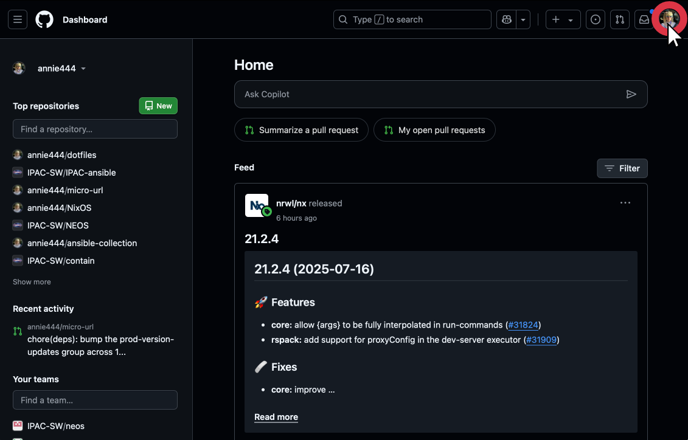
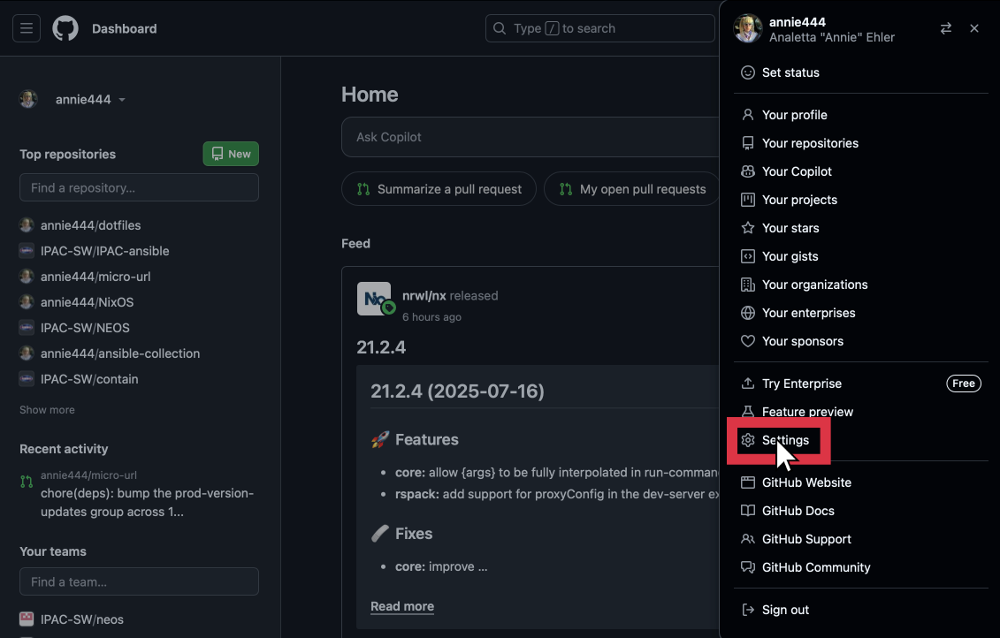
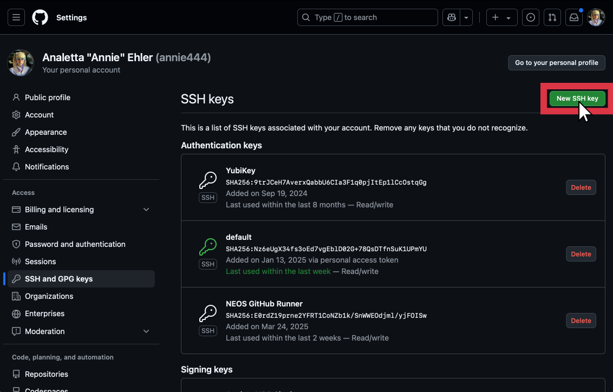
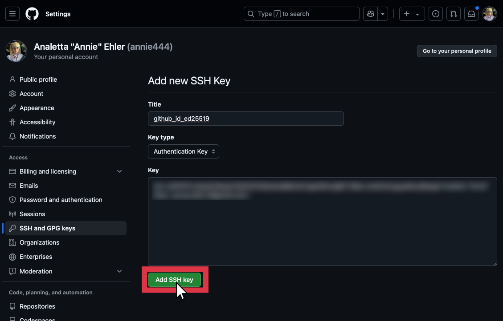
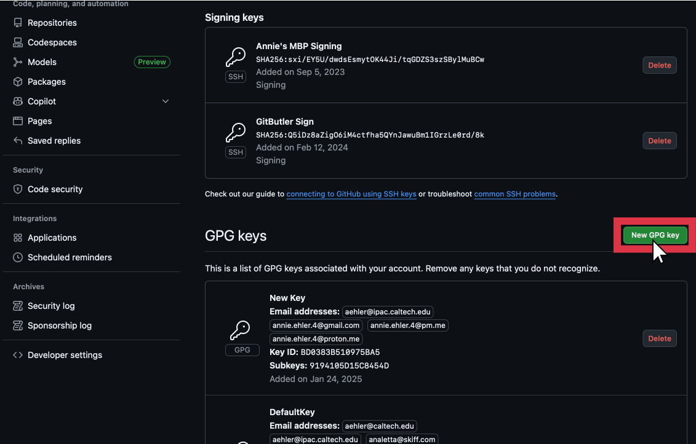
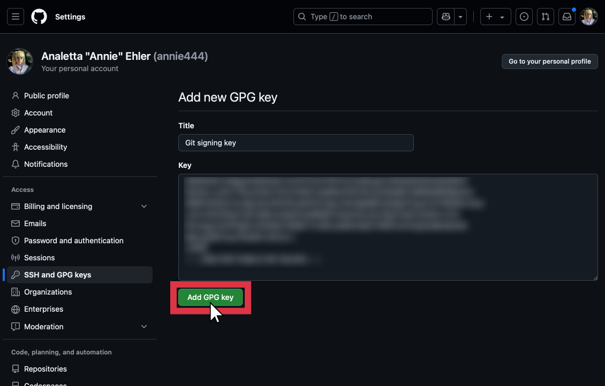

# dotfiles-templte

Basic template repository for managing your dotfiles with GNU Stow

## Getting started

This is a template repository, so you can easily use this repo to make your own dotfiles repo.

If you do use this template, please follow either the [quickstart](#quickstart) or the [full setup](#full-setup) instructions.

**Which starting guide should you follow?**

- **[Quickstart](#quickstart):** This is a good starting place if you're already familiar with the `ssh` and `gpg` CLI as well as the various other CLI tools (e.g. `ssh-copy-id`).
- **[Full Setup](#full-setup):** This is a more in-depth walk through that will guide you though creating your `ssh` and `gpg` keys as well as adding them to your GitHub account. **This is the recommended starting place.**

### Quickstart

**NOTE:** This is not a complete setup, and you will need to generate your own SSH and GPG key prior to the following steps. If you want a complete guide, view the [full setup](#full-setup) instructions.

I've included some helper scripts to aid in getting started:

1. **Configure git**: Use the `./config.sh` script to set your _name_, _email_, and _GPG key_ for use with git.
2. **Setting up SSH**: The SSH config at `./ssh/.ssh/config` is very minimal. You're expected to add hosts on your own.
3. **Generating a GitHub SSH key**: This repo expects there to be an SSH key at `~/.ssh/github_id_ed25519` used for git authentication.

### Full Setup

Under each drop down there is a set of detailed instructions for getting started. In each step, you'll encounter statements between greater-than (`>`) and less-than (`<`) signs. These should be replaced with the appropriate contents without the signs. (_e.g._, `-C "<your-full-name>"` would become `-C "Johnny Appleseed"`)

<details>

<summary><strong>Prologue:</strong> Installing dependencies.</summary>

<details>

<summary>Instructions for MacOS</summary>

```shell
brew install openssh sshpass gpg pinentry pinentry-mac stow
```

</details>

<details>

<summary>Instructions for RPM-based Linux distributions (<em>e.g.</em>, Fedora, RHEL, CentOS, <em>etc.</em>)</summary>

```shell
sudo dnf install openssh openssh-askpass stow pinentry pinentry-tty
```

> Optionally:
>
> ```shell
> sudo dnf install pinentry-emacs
> ```

</details>

<details>

<summary>Instructions for DEB-based Linux distributions (<em>e.g.</em>, Debian, Ubuntu, Pop! OS, <em>etc.</em>)</summary>

```shell
sudo apt-get install ssh sshpass gpg gpg-agent pinentry-curses pinentry-tty stow
```

</details>

</details>

<details>

<summary><strong>Step 1:</strong> Generating SSH keys</summary>

You're going to need at least two SSH keys. You're welcome to create more, however, you'll only _need_ two. There is a chance that these keys already exist on your system, which is okay. You may safely skip this step if these files already exist.

In the following command `<email-address>` should be replaced with your email address following the convention set forth in [RFC 2822](https://datatracker.ietf.org/doc/html/rfc2822). For example, a user _Johnny Appleseed_ with an email address _johnny@appleseed.com_ would become `Johnny Appleseed <johnny@appleseed.com>`

> You'll be asked when generating the keys if you'd like to set a password. It's _strongly recommended_ that you set a password, although it is _not required_.

This is the base key. This key will be used when no other key is specified. There is a strong chance that this key already exists on your system, which is okay.

```shell
ssh-keygen \
  -t ed25519 \
  -C "<email-address>" \
  -f ~/.ssh/id_ed25519
```

This is the key that will be used for accessing GitHub. This key most likely does not exist on your system, but if it does, that is okay and you may continue on.

```shell
ssh-keygen \
  -t ed25519 \
  -C "<email-address>" \
  -f ~/.ssh/github_id_ed25519
```

</details>

<details>

<summary><strong>Step 2:</strong> Setting up your ssh config (<em>i.e.</em>, ~/.ssh/config)</summary>

Because this repo is set up with GNU Stow[^1], all of the following modifications should be made to the file at **[ssh/.ssh/config](ssh/.ssh/config)**. However, you may want to start by editing you SSH config at **~/.ssh/config** and then copying the contents to **[ssh/.ssh/config](ssh/.ssh/config)**. If your SSH config is not empty **do not** remove it's contents. Rather, you should merge the following lines with your existing SSH config as needed.

For instance, if you already have a `Host *` block, then simply append the lines under the `Host *` block below to the end of your existing `Host *` block. If you encounter a directive within a block that you already have in your existing SSH config, then it is up to you whether you overwrite that directive or keep your existing one. For instance, if you already have a `UserKnownHostsFile` directive under your `Host *` block, you may choose to keep your existing `UserKnownHostsFile` or replace it with the one given below.

```
# ~/.ssh/config
Host github.com
  HostName github.com
  IdentityFile ~/.ssh/github_id_ed25519

Host gist.github.com
  HostName gist.github.com
  IdentityFile ~/.ssh/github_id_ed25519

Host *
  UserKnownHostsFile ~/.ssh/known_hosts
```

If you often are SSHing into hosts that share a common domain name (_e.g._, `example.com`), you can modify your SSH config to inform SSH of this canonical domain. This will tell SSH to resolve domain names for the given domain name _if possible_.

For instance, if you are commonly SSHing into the hosts `host1.example.com` and `host2.example.com`, the following configuration will allow you to simple type `ssh host1` or `ssh host2`, respectively.

```
# ~/.ssh/config

...

Host *
  UserKnownHostsFile ~/.ssh/known_hosts
  CanonicalizeHostname yes
  CanonicalDomains <common-domain> # e.g., example.com
```

Additionally, if you'd like to configure custom SSH settings for the canonicalized hosts (_e.g._, to use a unique SSH key for them), you can add a block to your SSH config like so:

```
# ~/.ssh/config

...

Match canonical host *.<canonical-domain> # e.g. example.com
  User <remote-username> # e.g. jappleseed
  IdentityFile <path/to/your/custom/ssh/key> # e.g. ~/.ssh/example_id_ed25519

...

```

You may want to add more rules for the hosts within this canonical domain, which you can do with a nested block. Here is an example scenario for our ficional character Johnny Appleseed.

- Johnny uses the username `johnnyappleseed` for accessing the hosts:
  - `project1host1.example.com`
  - `project1host2.example.com`
- Johnny uses the username `japple` for accessing the hosts:
  - `project2host1.example.com`
  - `project2host2.example.com`
- Johnny uses the username `jappleseed` for accessing all other hosts at `example.com`.

In this scenario, Johnny would modify his `~/.ssh/config` like so:

```
# ~/.ssh/config

...

Match canonical host *.example.com
  User jappleseed
  IdentityFile ~/.ssh/example_id_ed25519

  Match host project1*
    User johnnyappleseed

  Match host project2*
    User japple
...

```

You can read more about the syntax used for the `~/.ssh/config` in the official OpenSSH documentation[^2].

</details>

<details>

<summary><strong>Step 3:</strong> Adding your SSH key to GitHub</summary>

While GitHub[^3] and GitLab[^4] provide detailed instructions for adding an SSH key to your account, the following is an abridged version. If you run into an issue with the following steps, please see the official documentation[^3] [^4].

**1. Copy the contents of your public key**

<details>

<summary>Here is a shortcut for copying the contents of the file using a single shell command.</summary>

<details>

<summary>Instructions for MacOS</summary>

```shell
cat ~/.ssh/github_id_ed25519.pub | pbcopy
```

</details>

<details>

<summary>Instructions for Linux hosts using the Wayland compositor</summary>

```shell
cat ~/.ssh/github_id_ed25519.pub | wl-copy
```

</details>

<details>

<summary>Instructions for Linux hosts using the Xorg compositor</summary>

```shell
cat ~/.ssh/github_id_ed25519.pub | xclip
```

</details>

</details>

**2. Go to [github.com](https://github.com/) and click on your profile photo**

> Make sure you're logged in to GitHub.



**3. Go to "Settings"**



**4. Go to "SSH and GPG keys"**


**5. Click "New SSH Key"**



**6. Paste the contents of your public key and click "Add SSH Key"**



**Finished!**

Now when you're cloning a repository from GitHub, you should use the SSH syntax.

For example, instead of typing:

```shell
git clone https://github.com/annie444/dotfiles-templte.git
```

You should instead use:

```shell
git clone git@github.com:annie444/dotfiles-templte.git
```

To modify a repository you've already cloned locally, you can run:

```shell
git remote set-url origin git@github.com:<owner>/<repo>.git
```

> The HTTPS syntax is: `https://github.com/<owner>/<repo>.git`
>
> The SSH syntax is: `git@github.com:<owner>/<repo>.git`

</details>

<details>

<summary><strong>Step 4:</strong> Generate a GPG key</summary>

The following command is interactive. You'll be asked multiple questions, which should be answered as followed.

```shell
gpg --full-generate-key
```

Question 1: `Please select what kind of key you want:`

Answer: `ECC (sign and encrypt)` (usually number 9)

Question 2: `Please select which elliptic curve you want:`

Answer: `Curve 25519` (usually number 1)

Question 3: `Please specify how long the key should be valid.`

Answer: This is up to you, however, I often go with 0 (zero). This sets the key to not expire. However, most people recommend that you set it for no longer than 10 years.

Following these questions, you'll be asked for your name, email address, and an optional comment to include with the key. You'll also be prompted to set a password. **It is imperative that you set a password for you GPG key!**

You'll finall be asked if all of the information is okay. Feel free to modify the personal information if needed. Once you're satisfied with the contents of the key, respond with O for _Okay_.

</details>

<details>

<summary><strong>Step 5:</strong> Setting the pinentry program for GPG</summary>

<details>

<summary>Instructions for MacOS</summary>

If you'd like to use a GUI when prompted for the password for your GPG key, type the following:

```shell
echo "pinentry-program $(which pinentry-mac)" >> ~/.gnupg/gpg-agent.conf
```

If you'd like to use a terminal when prompted for the password for your GPG key, type the following:

```shell
echo "pinentry-program $(which pinentry-curses)" >> ~/.gnupg/gpg-agent.conf
```

</details>

<details>

<summary>Instructions for Linux</summary>

```shell
echo "pinentry-program $(which pinentry-curses)" >> ~/.gnupg/gpg-agent.conf
```

</details>

Once you've run the commands above, you'll also need to setup the GPG agent for your terminal. To set this up, you should add the following lines to your shell init file: (_e.g._, `~/.bashrc` for `bash`)

```shell
source ~/.gnupg/gpg.sh
```

> If you use a shell other than `sh`, `bash`, or `zsh` (you can find your shell with `echo $SHELL`), there are scripts for `csh`, `tcsh`, and `fish` also included in this repo. Simply change the sourced file to the file corresponding to your shell. (_e.g._, `source ~/.gnupg/gpg.csh` for `csh` or `tcsh`)

</details>

<details>

<summary><strong>Step 6:</strong> Adding your GPG key to GitHub</summary>

While GitHub[^5] and GitLab[^6] provide detailed instructions for adding a GPG key to your account, the following is an abridged version. If you run into an issue with the following steps, please see the official documentation[^5] [^6].

**1. Find your GPG key fingerprint**

To list the fingerprints of the secret keys on your system, use the command:

```shell
gpg --list-secret-keys
```

The output should be something like this:

```shell
sec   ed25519 2025-07-16 [SC]
      6A4WV6QYV2PFNSJ4HNN2GFD0G9P60ZAO3G85IUFG
uid           [ultimate] <full-name> (<comment>) < <email-address> >
ssb   cv25519 2025-07-16 [E]
```

The fingerprint of your GPG key is the random string of capital letters and numbers on the second line. Your output may be different, in which case the fingerprint is usually the first random string within the output block.

You'll want to copy your key's fingerprint for the next step

**2. Copy your public key**

To view the complete public key, use the command:

```shell
gpg --armor --export <fingerprint>
```

> **Tip:** use the pipe from _Step 3: Adding your SSH key to GitHub_ to easily copy the output straight to the clipboard!

**3. Go to [github.com](https://github.com/) and click on your profile photo**

> Make sure you're logged in to GitHub.


**4. Go to "Settings"**


**5. Go to "SSH and GPG keys"**


**6. Scroll down and click "New GPG key"**



**7. Paste the contents of your public GPG key and click "Add GPG key"**



**Finished!**

Don't forget your GPG key fingerprint, as you'll need it for the [setup script](./config.sh) later

</details>

Once you've followed the steps above, you can now proceed to the [quickstart](#quickstart) and follow the steps there!

## Setting up a new host

1. The `./bootstrap.sh` script is used for copying the SSH keys an GPG keys to a remote host. You'll want to use this script first before continuing to setup a new host.
2. The `./install.sh` script is used to install the dotfiles on a new host. This script mainly ensures all the expected files are present and sets the paths to executables that are different from host to host. _Note_: If this script fails with an error like `stowing <something> would cause conflicts`, it means that those dotfiles already exist. You can either run `stow <target> --adopt` or you can delete the conflicting files (e.g., for ssh, it would be `~/.ssh/config`) and then run `stow <target>`.
3. You'll need to make sure that your shell is sourcing the script `~/.gnupg/gpg.sh` at startup. If you're using `bash` or `zsh` should add the line `source ~/.gnupg/gpg.sh` to your `~/.bashrc` or `~/.zshrc`.

[^1]: https://www.gnu.org/software/stow/manual/stow.html

[^2]: https://www.ssh.com/academy/ssh/config

[^3]: https://docs.github.com/en/authentication/connecting-to-github-with-ssh/adding-a-new-ssh-key-to-your-github-account

[^4]: https://docs.gitlab.com/user/ssh/#add-an-ssh-key-to-your-gitlab-account

[^5]: https://docs.github.com/en/authentication/managing-commit-signature-verification/adding-a-gpg-key-to-your-github-account

[^6]: https://docs.gitlab.com/user/project/repository/signed_commits/gpg/#add-a-gpg-key-to-your-account
